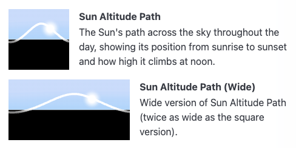

# astronomy-svg

**astronomy-svg** is a lightweight tool to generate astronomy-themed Scalable Vector Graphics (SVG) images easily. Perfect for web developers, educators, astronomers, and space enthusiasts who want beautiful, customizable visuals of space elements without needing to design from scratch.

---
## 🚀 See It in Action!
These tiles were generated using the astronomy-svg library.

👉 [**Check out the live demo here**](https://alexandreribeiro.github.io/astronomy-svg/demo/)

[](https://alexandreribeiro.github.io/astronomy-svg/demo/)


---

## 🪐 Features

- Visual representation of astronomical data from any location on Earth
- Simple API to generate SVG tiles
- Lightweight
- Embeddable in websites, apps, presentations, and documents
- 🔭 Includes Pluto!

---

## Quickstart

### 🌐 Using the Browser-Ready Minified Script

```javascript
<script type="text/javascript" src="astronomy-svg.min.js"></script>
// latitude, longitude
let astronomySVG = AstronomySVG.initialize(56.2, 18.1)
// 100px, isRectangular=false.
astronomySVG.drawSunAltitudePath(100, false);
```

### 🌟 Installation (npm)

```bash
npm install astronomy-svg
```

#### Using the JavaScript ES Module
```javascript
import { AstronomySVG } from "astronomy-svg";
// latitude, longitude
let astronomySVG = AstronomySVG.initialize(56.2, 18.1)
// 100px, isRectangular=false.
astronomySVG.drawSunAltitudePath(100, false);
```

## 📄 License

This project is licensed under the MIT License — feel free to use, modify, and share it.  
Please make sure to retain the original license and attribution when reusing or modifying the code.  
See the [LICENSE](./LICENSE) file for full details.
